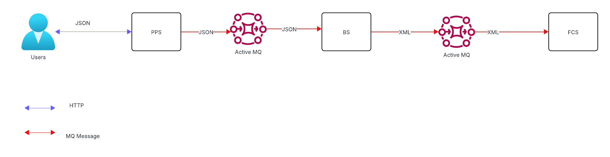
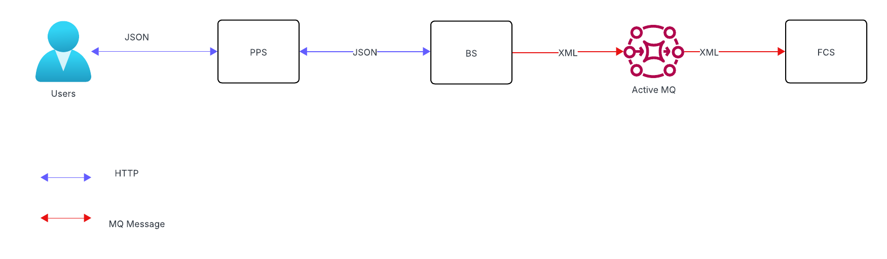
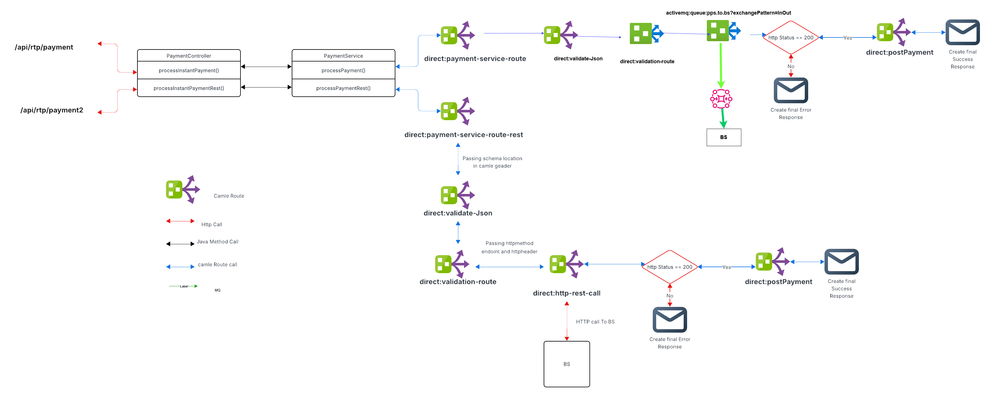
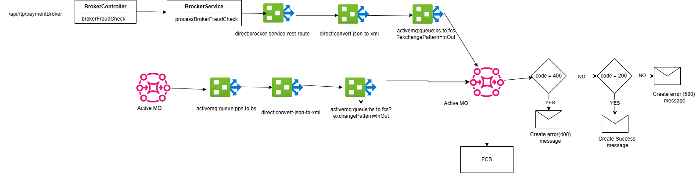

# db-poc-payment
db-poc-payment

# Fraud Check PoC - Two Solutions

This repository contains the code and configurations for a Proof of Concept (PoC) demonstrating two different approaches for integrating a Payment Processing System (PPS) with a Fraud Check System (FCS) through a Broker System (BS). The BS acts as an intermediary, insulating the PPS from the specifics of the FCS.

## PoC Description

The PoC simulates a scenario where a fraud check needs to be performed before a bank honors a payment. The following systems are mocked:

* **Payment Processing System (PPS):** Simulates the initiation of payment transactions.
* **Fraud Check System (FCS):** Simulates a system that performs fraud checks on payment transactions.
* **Broker System (BS):** Acts as an intermediary between the PPS and FCS, handling communication and potential data transformations.

Two distinct solutions are implemented to demonstrate different integration strategies between the PPS and the BS:

**Solution 1: Messaging via JSON (PPS <-> BS)**

* Communication between the **PPS** and the **BS** is based on **synchronous messaging** using **JSON** as the data format.
* Communication between the **BS** and the **FCS** is based on **synchronous messaging** using **XML** as the data format.
* Internal communication within each system (PPS, BS, FCS) preferably utilizes **messaging**.

**Solution 2: REST APIs via JSON (PPS <-> BS)**

* Communication between the **PPS** and the **BS** is based on **synchronous RESTful APIs** using **JSON** for request and response bodies.
* Communication between the **BS** and the **FCS** remains based on **synchronous messaging** using **XML** as the data format.
* Internal communication within each system (PPS, BS, FCS) preferably utilizes **messaging**.

## Solution 1

## Solution 2

## PPS

## BS

